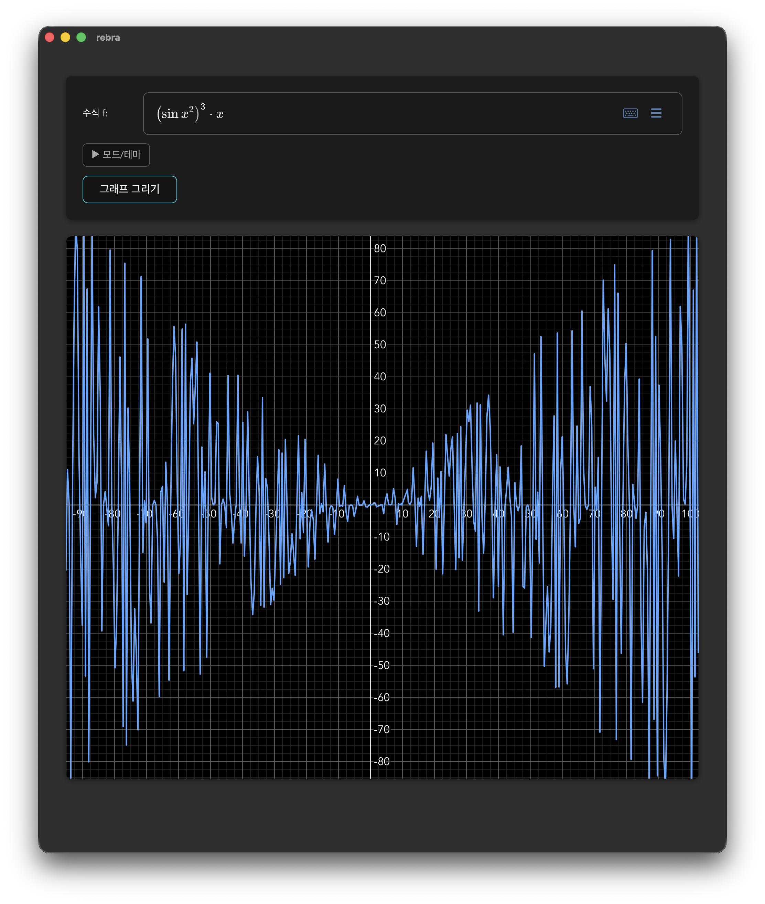
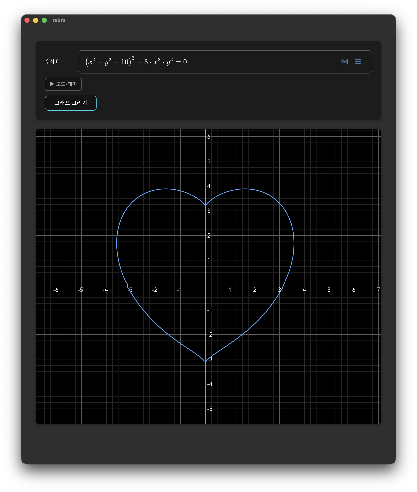

<p align="center">
  <strong>🌐 언어 / Language</strong><br>
  <a href="#ko">한국어</a> · <a href="#ja">日本語</a>
</p>

---

<a id="ko"></a>

# R_R_Gebra

Tauri 기반 수학 그래프 앱 (GeoGebra 스타일). LaTeX 수식을 입력하면 Rust로 계산하고, Mafs로 그래프를 그립니다.

## 스크린샷

|                                          |
| :--------------------------------------: |
|      |
| _수식 입력과 explicit 그래프 (y = f(x))_ |

|                                      |
| :----------------------------------: |
|  |
|     _Implicit 방정식 (f(x,y)=0)_     |

---

## 실행

```bash
npm install
npm run tauri dev
```

---

## 아키텍처

### 기술 스택

| 구분 | 기술 |
|------|------|
| 프론트엔드 | React 19, TypeScript, Vite |
| 백엔드 | Rust (Tauri 2.0) |
| 그래프 | Mafs |
| 수식 입력 | MathLive (LaTeX) |
| 상태 | Zustand |
| 스타일 | SCSS Modules |

### 프로젝트 구조

```
R_R_Gebra/
├── src/
│   ├── components/        # FormulaInput, GraphCanvas, ViewportObserver
│   ├── store/             # graphStore, themeStore
│   ├── utils/latexToMeval.ts
│   ├── api.ts             # Tauri invoke 래퍼
│   └── constants.ts
└── src-tauri/src/
    ├── lib.rs             # Tauri 커맨드 등록
    └── math_engine.rs     # 수식 파싱·평가 (meval)
```

### 데이터 흐름

```
LaTeX 입력 → FormulaInput → latexToMeval() → 수식 타입 감지
  → 캐시 확인 → (미스 시) Tauri invoke → math_engine
  → Point[] / Point[][] → 캐시 저장 → GraphCanvas (Mafs 렌더)
```

### API (`src/api.ts`)

| 함수 | 요청 | 반환 |
|------|------|------|
| `calculateGraph` | formula, x_min, x_max, step | Point[] |
| `calculateImplicit` | formula, x_min~y_max, grid_size | Point[][] |

### 캐시

- LRU 최대 20건 (graphCache, implicitCache 각각).
- Explicit 키: `formula|xMin|xMax|step`
- Implicit 키: `formula|xMin|xMax|yMin|yMax|gridSize`

---

## 컴포넌트

- **FormulaInput** (`src/components/FormulaInput.tsx`): MathLive LaTeX 입력, 수식 타입(explicit/implicit) 감지, 뷰포트 모드(자동/수동), 테마, 수동 범위(x/yMin/Max, step). 500ms 디바운스.
- **GraphCanvas** (`src/components/GraphCanvas.tsx`): Mafs로 그래프 렌더. Explicit는 포인트 배열, Implicit는 marching squares로 여러 곡선. ResizeObserver, 캐시 조회 후 API 호출.
- **ViewportObserver** (`src/components/ViewportObserver.tsx`): 자동 모드에서 보이는 영역 추적. Mafs `usePaneContext()`, 250ms 디바운스, `X_RANGE_LIMIT`(2e6)로 클램핑.
- **graphStore** (`src/store/graphStore.ts`): formula, 범위, points/implicitCurves, loading/error, viewportMode/Bounds, 캐시.
- **themeStore** (`src/store/themeStore.ts`): light/dark/system, `data-theme`, localStorage 유지.

---

## 수학 엔진 (Rust, `src-tauri/src/math_engine.rs`)

- **calculate_graph**: `y=f(x)` — meval 파싱, x에 바인딩, x_min~x_max를 step 간격 샘플링, inf/nan 제거 → `Vec<Point>`.
- **calculate_implicit**: `f(x,y)=0` — 2D 그리드에서 f 평가, marching squares로 영점 교차, 곡선 연결(saddle 케이스 처리) → `Vec<Vec<Point>>`.
- **log(x)**: 상용로그 `ln(x)/ln(10)`. sin, cos, tan, asin, acos, atan, sinh, cosh, tanh, ln, exp, abs 등 지원.

---

## 설정 상수 (`src/constants.ts`)

| 상수 | 값 | 설명 |
|------|-----|------|
| POINTS_PER_VIEW | 500 | explicit 뷰포트당 샘플 수 |
| X_RANGE_LIMIT | 2e6 | x 범위 상한 (줌 아웃 시 과계산 방지) |
| IMPLICIT_GRID_MIN/MAX | 80 / 320 | implicit 그리드 해상도 (span×12로 계산 후 클램핑) |
| MAX_CACHE_ENTRIES | 20 | 캐시당 LRU 최대 개수 |

---

## 지원 수식

**Explicit** `y = f(x)` 와 **Implicit** `f(x,y) = 0` 형태를 지원합니다. 변수는 `x`, `y`를 사용하세요.

- **수식 타입 감지** (`src/utils/latexToMeval.ts`): `=` 없음 → explicit, `y =` → explicit, 그 외 `=` → implicit.
- **Implicit 변환**: `f(x,y)=g(x,y)` → meval `(left)-(right)` (예: `x^2+y^2=1` → `(x^2+y^2)-(1)`).

### 지원 함수

| LaTeX                                    | meval               | 예시              |
| ---------------------------------------- | ------------------- | ----------------- |
| `\sin(x)`, `\cos(x)`, `\tan(x)`          | sin, cos, tan       | `sin(x) + cos(x)` |
| `\arcsin(x)`, `\arccos(x)`, `\arctan(x)` | asin, acos, atan    | `arctan(x)`       |
| `\sinh(x)`, `\cosh(x)`, `\tanh(x)`       | sinh, cosh, tanh    | `cosh(x)`         |
| `\asinh(x)`, `\acosh(x)`, `\atanh(x)`    | asinh, acosh, atanh | `tanh(x)`         |
| `\ln(x)`, `\log(x)`, `\log_{10}(x)`      | ln, log (상용로그)  | `ln(x)`, `log(x)` |
| `\exp(x)`                                | exp                 | `exp(-x^2)`       |
| `\sqrt{x}`                               | sqrt                | `sqrt(x)`         |
| `\frac{a}{b}`                            | (a)/(b)             | `(x+1)/(x-1)`     |
| `x^{n}`, `x^n`                           | x^(n)               | `x^2`, `x^(1/2)`  |
| `\pi`, `\e`                              | pi, e               | `sin(pi*x)`       |
| `\cdot`, `\times`                        | \*                  | `x \cdot 2`       |
| `\abs{x}`                                | abs                 | `abs(x)`          |

### 미지원 (에러 메시지 표시)

- 적분 `\int`, `\iint`, `\oint`
- 합/곱 `\sum`, `\prod`
- 극한 `\lim`

### 모드

- **뷰포트 자동**: 줌/팬한 구간만 계산 (기본값)
- **수동 범위**: x/y 최소·최대·간격 직접 입력

---

## Recommended IDE Setup

- [VS Code](https://code.visualstudio.com/) + [Tauri](https://marketplace.visualstudio.com/items?itemName=tauri-apps.tauri-vscode) + [rust-analyzer](https://marketplace.visualstudio.com/items?itemName=rust-lang.rust-analyzer)

---

<a id="ja"></a>

# 🇯🇵 日本語

Tauri ベースの数学グラフアプリ（GeoGebra 風）。LaTeX 式を入力すると Rust で計算し、Mafs でグラフを描画します。

## スクリーンショット

|                                         |
| :-------------------------------------: |
|    |
| _数式入力と explicit グラフ (y = f(x))_ |

|                                       |
| :-----------------------------------: |
|  |
|     _Implicit 方程式 (f(x,y)=0)_      |

---

## 実行方法

```bash
npm install
npm run tauri dev
```

---

## アーキテクチャ

### 技術スタック

| 区分 | 技術 |
|------|------|
| フロント | React 19, TypeScript, Vite |
| バック | Rust (Tauri 2.0) |
| グラフ | Mafs |
| 数式入力 | MathLive (LaTeX) |
| 状態 | Zustand |
| スタイル | SCSS Modules |

### プロジェクト構造

```
R_R_Gebra/
├── src/
│   ├── components/        # FormulaInput, GraphCanvas, ViewportObserver
│   ├── store/             # graphStore, themeStore
│   ├── utils/latexToMeval.ts
│   ├── api.ts             # Tauri invoke ラッパー
│   └── constants.ts
└── src-tauri/src/
    ├── lib.rs             # Tauri コマンド登録
    └── math_engine.rs     # 式パース・評価 (meval)
```

### データフロー

```
LaTeX 入力 → FormulaInput → latexToMeval() → 式タイプ判定
  → キャッシュ確認 → (ミス時) Tauri invoke → math_engine
  → Point[] / Point[][] → キャッシュ保存 → GraphCanvas (Mafs 描画)
```

### API (`src/api.ts`)

| 関数 | リクエスト | 戻り値 |
|------|------------|--------|
| `calculateGraph` | formula, x_min, x_max, step | Point[] |
| `calculateImplicit` | formula, x_min～y_max, grid_size | Point[][] |

### キャッシュ

- LRU 最大 20 件（graphCache / implicitCache 各）。Explicit キー: `formula|xMin|xMax|step`。Implicit: `formula|xMin|xMax|yMin|yMax|gridSize`。

---

## コンポーネント

- **FormulaInput**: MathLive LaTeX 入力、式タイプ(explicit/implicit)判定、ビューポート(自動/手動)、テーマ、手動範囲。500ms デバウンス。
- **GraphCanvas**: Mafs でグラフ描画。Explicit はポイント配列、Implicit は marching squares で複数曲線。
- **ViewportObserver**: 自動モードで表示範囲追跡。250ms デバウンス、X_RANGE_LIMIT(2e6) でクランプ。
- **graphStore** / **themeStore**: グラフ状態・キャッシュ、テーマ(localStorage 永続)。

---

## 数式エンジン (Rust, `math_engine.rs`)

- **calculate_graph**: `y=f(x)` を meval でパース・サンプリング → `Vec<Point>`。
- **calculate_implicit**: `f(x,y)=0` を 2D グリッド＋marching squares で曲線化 → `Vec<Vec<Point>>`。
- log(x) は常用対数。sin, cos, tan, asin, acos, atan, sinh, cosh, tanh, ln, exp, abs 等対応。

---

## 定数 (`src/constants.ts`)

POINTS_PER_VIEW=500、X_RANGE_LIMIT=2e6、IMPLICIT_GRID 80～320、MAX_CACHE_ENTRIES=20。

---

## 対応数式

**Explicit** `y = f(x)` と **Implicit** `f(x,y) = 0` 形式をサポート。変数は `x`, `y` を使用。

- **式タイプ判定** (`latexToMeval.ts`): `=` なし→explicit、`y =`→explicit、それ以外の `=`→implicit。
- **Implicit 変換**: `f(x,y)=g(x,y)` → meval の `(left)-(right)`。

### 対応関数

| LaTeX                                    | meval               | 例                |
| ---------------------------------------- | ------------------- | ----------------- |
| `\sin(x)`, `\cos(x)`, `\tan(x)`          | sin, cos, tan       | `sin(x) + cos(x)` |
| `\arcsin(x)`, `\arccos(x)`, `\arctan(x)` | asin, acos, atan    | `arctan(x)`       |
| `\sinh(x)`, `\cosh(x)`, `\tanh(x)`       | sinh, cosh, tanh    | `cosh(x)`         |
| `\ln(x)`, `\log(x)`, `\log_{10}(x)`      | ln, log（常用対数） | `ln(x)`, `log(x)` |
| `\exp(x)`                                | exp                 | `exp(-x^2)`       |
| `\sqrt{x}`                               | sqrt                | `sqrt(x)`         |
| `\frac{a}{b}`                            | (a)/(b)             | `(x+1)/(x-1)`     |
| `x^{n}`, `x^n`                           | x^(n)               | `x^2`, `x^(1/2)`  |
| `\pi`, `\e`                              | pi, e               | `sin(pi*x)`       |
| `\cdot`, `\times`                        | \*                  | `x \cdot 2`       |
| `\abs{x}`                                | abs                 | `abs(x)`          |

### 非対応（エラーメッセージ表示）

- 積分 `\int`, `\iint`, `\oint`
- 和・積 `\sum`, `\prod`
- 極限 `\lim`

### モード

- **ビューポート自動**: ズーム・パンした範囲のみ計算（デフォルト）
- **手動範囲**: x/y の最小・最大・刻みを直接入力

---

## 推奨 IDE

- [VS Code](https://code.visualstudio.com/) + [Tauri](https://marketplace.visualstudio.com/items?itemName=tauri-apps.tauri-vscode) + [rust-analyzer](https://marketplace.visualstudio.com/items?itemName=rust-lang.rust-analyzer)
